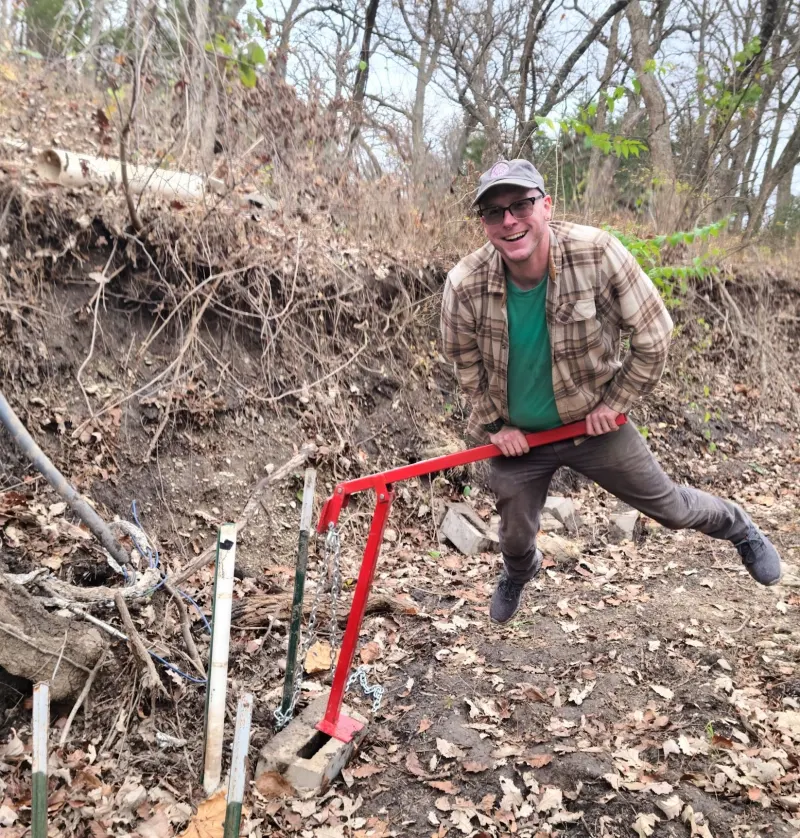
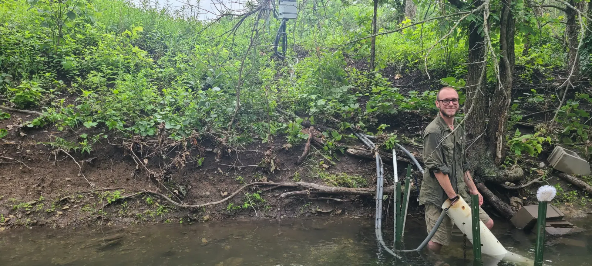

::::: grid
::: g-col-4

[](https://github.com/ConnorB){target="_blank"} &nbsp;
[](https://fediscience.org/@connor){target="_blank"} &nbsp;
[](https://instagram.com/conbro_){target="_blank"} &nbsp;
[](https://bsky.app/profile/connorbrown.bsky.social){target="_blank"} &nbsp;
[](https://x.com/eco_conn){target="_blank"} &nbsp;
[](https://scholar.google.com/citations?user=ppjBxFEAAAAJ&hl=en){target="_blank"} &nbsp;
[](https://orcid.org/0000-0002-9680-8930){target="_blank"}

:::

::: g-col-8
I am a PhD Candidate at the [Kansas Geological Survey](https://www.kgs.ku.edu/) and Department of Geology at the University of Kansas in [Dr. Erin Seybold’s](http://www.erinseybold.com/) lab, where I study ecosystem ecology and biogeochemical cycling in non-perennial streams as part of the Aquatic Intermittency Effects on Microbiomes in Streams (AIMS) project.

I previously completed an M.S. in Biology at Sam Houston State University, where I worked with [Dr. Amber Ulseth](https://nrri.umn.edu/faculty-staff/amber-j-ulseth-phd) on linking land use and precipitation regime changes to stream metabolism in subtropical Texas coastal streams. Before that, I earned a B.S. in Natural Resource Management (Fisheries and Aquatic Biology) at Texas Tech University, working with [Dr. Allison Pease](https://cafnr.missouri.edu/person/allison-pease/) and [Dr. Kelbi Delaune](https://twitter.com/Aquatic_Kel) on Pecos River macroinvertebrate communities.

My research focuses on carbon cycling in non-perennial streams. I am broadly interested in stream ecosystem ecology, hydrology, biogeochemistry, and data science.
:::
:::::
{fig-align="center" fig-alt="Connor standing in Kings Creek doing sensor maintenance" loading="lazy"}

